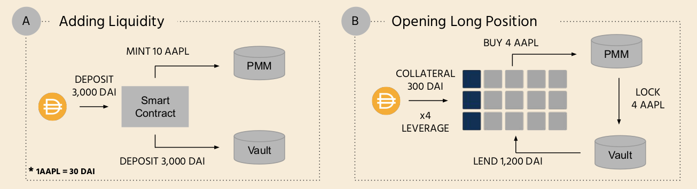

Tamago Finance is a PMM-based perpetual swap protocol made for all asset classes from common stocks, financial indicators to on-chain states built on Acala/Polkadot (EVM-compatible) and designed with a focus on usability and user experience.

**PMM stands for Proactive Market Making Algorithm has been introduced by DODO (https://dodoex.io/)** 

## Current Features

* Non-orderbook perpetual swap protocol
* Open short or long positions up to 4x leverage on any asset classes
* Proactive price discovery mechanism
* Support APPL, TSLA stocks on Kovan
* Support DOT, renBTC tokens on Acala Mandala TC6
* Liquidation of the unsafe position


## How it works

Tamago Finance combines two mature DeFi concepts - Synthetic asset issuance protocol and DEXes to provide breakthrough end-to-end trading experiences and offer a great number of derivatives products that can be listed in the system.

The magic behinds is the DODO's Proactive Market Making model that applied into our price discovery mechanism, unlike other AMM-based non-orderbook derivatives DEXes on the market that require intervention from the project team when slippage is going high, the PMM model is capable of proactively adjusting mid prices to achieve higher capital efficiency from external sources.



**There are 3 groups of people participating in the protocol, including:** 

### A. Liquidity Provider

Liquidity Providers deposit money into the vault, synthetic tokens have been minted and put into circulation, the interest will be given similar to other lending protocols.

### B. Trader

Trader opens a long position by paying 1/4 and get 4x money on margin account to buy synthetic tokens from PMM, colleteral tokens will be acquired instead when opens a short position and lock up in the vault under trader's position.

If synthetic tokens drop value at a 60% rate then the position can be liquidated by anyone with the 10% penalty.

### Price steams

Asset prices are observed depending on the network.

Asset Symbol | Network  | Interval | Source 
--- | --- | --- | --- 
APPL | Kovan | Daily | Chainlink's Tiingo EOD Stock Price Oracle
TSLA | Kovan | Daily | Chainlink's Tiingo EOD Stock Price Oracle
renBTC | Acala TC6 | 15 minutes | Acala's Generic Oracle
DOT | Acala TC6 | 15 minutes | Acala's Generic Oracle

## Install

The project comprises of 4 components to deploy on both Kovan and Acala, at the very beginning we can install all dependencies for all of them in one-go by

```
yarn
```

### Solidity contracts

For deploy on most EVM-compatible blockchain, you can use this Truffle-based project and for development purpose you can deploy all contracts into your local ganache node.

```
cd core
truffle compile
truffle migration
```

### Solidity contracts (Acala)

Acala seems not yet support Truffle, so we're porting all contracts in /core into Waffle-based.

```
cd acala
yarn waffle
```

Later you would need to use **Acala EVM Playground** (https://evm.acala.network) to deploy all compiled files and manually config the perpetual contracts as in the migration script from /core folder.

### Dapp

This made by react-create-app that compatible to most modern browsers, to run it locally just run

```
cd client
yarn start
```

### Scheduler

The scheduler runs on a daily basis to trigger the request to Oracle and ensure the index price are up to date.

We're using **Pulumi** (https://www.pulumi.com/) as a automation tool for setup infrastucture on AWS cloud.

Ensure that you have Pulumi CLI in the your machine and then run.

```
cd backend
pulumi up
```

On-chain scheduler feature has been used on Acala side which is the managed schedule service that can greatly reduce maintenance cost on the project team side.

## License

* Open-source [MIT](LICENSE)